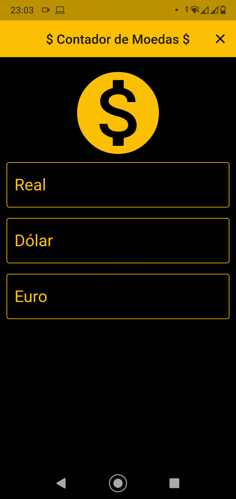

# CurrenciesConverter

A flutter application that access an API to request currency values.

## Install Dependencies:
To install the project flutter dependencies run:<br>
```
$ flutter pub upgrade
```

## Run Code:
### 1. Verify devices
Check if your device is connected in your PC:<br>
```
$ flutter devices
```
Your device should appear, for example:<br>


### 2. Run App
Browse to root directory of project and run the follow code:
```
$ flutter run
```
If you have more than one device connected in your PC, run with the following code, using the ID device that can be seen in code above.
```
$ flutter run -d deviceID
```
## App Execution:

